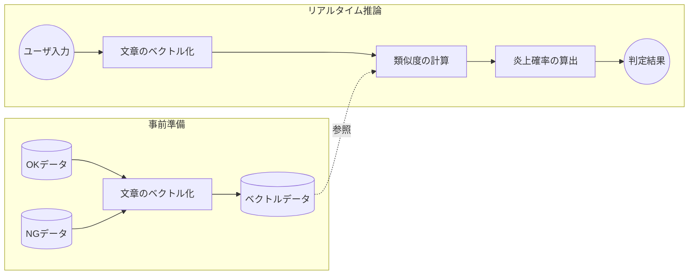

# Personalized Real-time Flaming Risk Prediction

IIAI AAI 2025 Winterに採録された、文章の炎上リスクをリアルタイムで予測する手法の実装およびデモプロトタイプです。

## 🌟 プロジェクト概要
SNS等における「炎上」や「不快感」の基準は、人それぞれの価値観によって異なります。本プロジェクトでは、判定基準となるデータセットを入れ替えるだけで、ユーザー個人の基準に最適化したリスク判定をリアルタイムで行うモデルを提案しました。

### システムアーキテクチャ (System Architecture)



## 🚀 特徴
- **パーソナライズ判定**: 比較対象となるデータセット（Safe/Out）を差し替えるだけで、個別の価値観に基づいた判定が可能です。
- **BERT + Mean Pooling**: BERTから得られる分散表現をMean Poolingで圧縮し、文全体の意味を捉えた高精度なベクトルを抽出します。
- **確信度の算出**: 単なる類似度比較に留まらず、ロジスティック回帰を用いて「何%の確率でリスクがあるか」という信頼度を算出します。
- **インタラクティブ・デモ**: Gradioを用いたWeb UIにより、未知の文章に対するリスク判定をブラウザ上で即座に体験できます。
- **マルチ属性の不快度判定**: 最も類似した過去の炎上事例から、具体的にどのような有害性（深刻度、猥褻性、脅迫性、侮辱性、差別性）を含んでいるかを詳細に出力します。
- **実運用向けWeb API（Docker対応）**: FastAPIを用いた軽量・高速なエンドポイントを提供。Dockerコンテナ化されているため、あらゆる環境に一瞬でデプロイ可能です。

## 📂 ディレクトリ構成
```text
├── notebooks/
│   ├── 01_preprocessing.ipynb      # テキストのクレンジングと整形
│   ├── 02_evaluation.ipynb         # 基本的な成功率（精度）の検証
│   ├── 03_vector_caching.ipynb     # 推論高速化のためのベクトル事前計算と保存(Pickle)
│   ├── 04_confidence_modeling.ipynb # 類似度を確率（信頼度）に変換するモデルの構築
│   └── 05_gradio_app.ipynb         # Gradioを用いたリアルタイムデモ実行
├── flaming-risk-api/
│   ├── Dockerfile                  # APIサーバーのコンテナ構成定義
│   ├── requirements.txt            # API実行に必要なライブラリ
│   └── main.py                     # FastAPIによる推論ロジック・エンドポイント本体
└── README.md
```

## 🛠 技術スタック
- **Language**: Python 3.x
- **Deep Learning**: PyTorch, Hugging Face Transformers (BERT)
- **Web Interface**: Gradio
- **Data Analysis**: Pandas, NumPy, Scikit-learn
- **Visualization**: Matplotlib
- **Other Tools**: deep_translator (翻訳API), tqdm (進捗管理), pickle (データ永続化)
- **Web API / Application**: FastAPI, Uvicorn, Gradio, Docker

## 📈 実績
- **IIAI AAI 2025 Winter Full Paper Accepted**
- **リアルタイム性の確保**: 事前ベクトル計算とバッチ処理の最適化により、実用的なレスポンス速度を実現。
- **高精度な信頼度スコア**: 類似度だけでなく、ロジスティック回帰を組み合わせた確率算出ロジックを独自に実装。

## 📖 使い方

### 1. 研究成果の検証（精度評価）
研究論文で提案した手法の再現手順です。
1. `notebooks/01_preprocessing.ipynb` を実行し、学習・テストデータのクレンジングを行います。
2. `notebooks/02_evaluation.ipynb` を実行し、コサイン類似度に基づいた分類成功率を確認します。

### 2. インタラクティブ・デモの実行（プロトタイプ）
Web UI上で実際にテキストを入力してリスク判定を行う手順です。
1. `notebooks/03_vector_caching.ipynb` を実行し、参照用データセットを高速読み込み用の `pickle` 形式で保存します。
2. `notebooks/04_confidence_modeling.ipynb` を実行し、類似度から「炎上確率（信頼度）」を導出するための学習モデルを作成します。
3. `notebooks/05_gradio_app.ipynb` を実行するとブラウザ上にUIが起動します。任意の英語（または自動翻訳経由の日本語）を入力して、リアルタイム判定を体験してください。

### 3. プロダクション向けWeb APIの起動（FastAPI + Docker）
システムや他のアプリケーションと連携するための、高速なWeb APIを起動する手順です。

#### 💡 事前準備（データの配置）
ライセンスおよび容量制限の都合上、推論に必要なキャッシュデータはリポジトリに同梱されていません。起動前に、ノートブック（03, 04）で生成された以下の2つのファイルを、手動で指定のフォルダに配置してください。

- 配置先: `flaming-risk-api/data/` （フォルダは新規作成）
- 必要ファイル:
  - `bert_vectors_data.pkl` （事前計算されたベクトルデータ）
  - `texts_label_data.pkl` （テキスト、各種有害属性ラベル、信頼度パラメータ）

#### 🚀 コンテナのビルドと起動
`flaming-risk-api/` ディレクトリに移動し、以下のコマンドを実行します。

```bash
# 1. Dockerイメージのビルド
docker build -t flaming-api .

# 2. コンテナの起動（ポート8000番でバインド）
docker run -p 8000:8000 flaming-api
```

#### 🌐 APIのテスト（Swagger UI）
サーバーが起動したら、ブラウザで以下のURLにアクセスすると、インタラクティブな自動生成ドキュメント（Swagger UI）からAPIの挙動を直接テストできます。
- **URL**: `http://localhost:8000/docs`

`POST /predict` エンドポイントに対し、以下の形式でリクエストを送信すると、判定結果、最も類似した過去事例、5つの有害属性スコア、および補正された確信度（%）がリアルタイムに返却されます。

**Request Body 例:**
```json
{
  "text": "ここに判定したい日本語の文章を入力"
}
```

## 📊 データセットについて
本プロジェクトでは、モデルの学習および検証に以下の公開データセットを利用しています。

- **Dataset**: [Jigsaw Toxic Comment Classification Challenge](https://www.kaggle.com/datasets/julian3833/jigsaw-toxic-comment-classification-challenge)
- **概要**: Wikipediaのコメント欄における有害性（Toxic, Severe Toxic, Obscene, Threat, Insult, Identity Hate）を分類するための大規模データセットです。

本手法では、このデータセットを「個人の価値観（Safe/Out）」という観点で再定義・サンプリングし、パーソナライズド・モデルの構築に活用しています。
※ライセンス遵守のため、本リポジトリにデータセット自体は同梱していません。上記リンクより取得してください。
